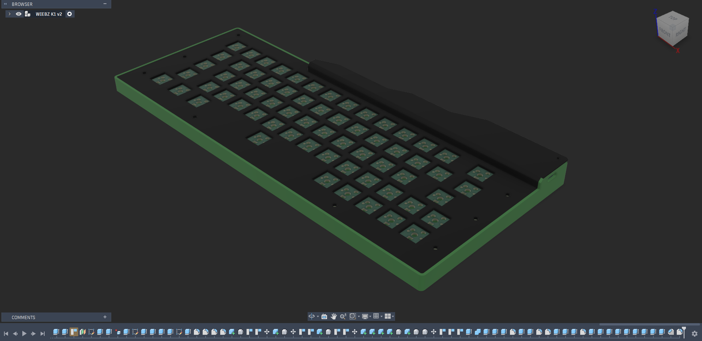
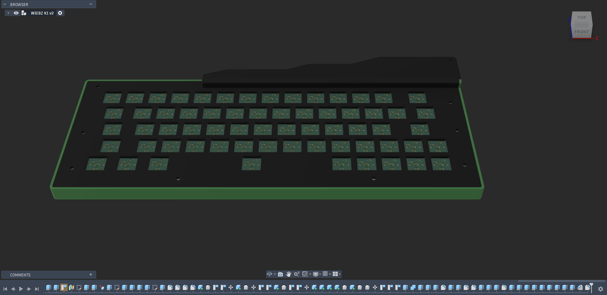
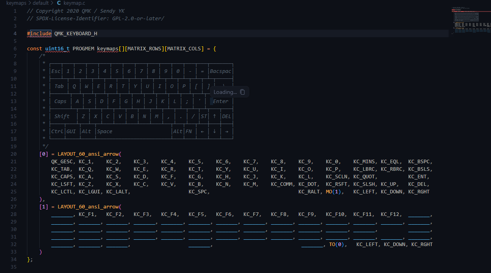

# August 31 2026: Designed the PCB Schematics
So today i officially started my project (i hope i finish it before the deadline💀💀)…so i started with the pcb schematics ….i didnt finish it today so ill try to do that tommorow (or some time….[im very busy]
(theres a duplicate...i cant find a way to delete the first)

**Total time spent: ~44m**

# September 2nd, 2026: Finished the PCB schematics
i finish the schematics of the keyboard today...connected all the rows and columns... so its remaining the pcb then the case

**Total time spent: 40m**

# September 3rd, 2026: Added SK6812 Mini-E leds and assigned footprints
wow...i completely forgot im supposed to add leds to the pcb...wow they are a lot and all to be hand soldered...so i did a long hard research onn the sk6812 led datasheets and the rest and found out that the ki cad version was mirrored the other way....so i mirrored it back. Also while assiging footprint i had to search for the big keys size for the stabilizers (Tab, caps, space and the rest)...it said that tab key was 1.5u but i thought it was 2u so i just cotinued like that and yh the spacebar remained the same at 6.25u...so now for the second time....unto the pcb

**Total time spent: ~43m**

# September 2nd, 2026: Decided to Make it Hot Swappable
i literally just found out today that its possible to hot swap the actual switches themselves....i wanted to add it to my keyboard so i tried doing some research on it (suprised it took this long)...and most of what i was seeing wasn't helpful....so i had to do it 😔😔...i used AI to help me explain the whole hotswappable switchs and also south facing switches and led placements  and so i went with the kailh mx hot swap circuits...i found the foot prints from another github repo (https://github.com/daprice/keyswitches.pretty)...

**Total time spent: ~1h**

# September 4th, 2026: Finally started the PCB
so i started the pcb design today and boy oh boy i had ALOT of issues...i had to reassign the footprints first was for all the switches to the kailh hot swappable socket...then also resized the big keys(shift, caps and tabs keys). i made a mistake mirroring the sk6812 mini-e led.....yes the kicad one was correct as the led would be mounted on the back of the PCB...so when you flip it (putting it on the bottom of the pcb the pads align)...that was just for the footprints....the main issue that i had her was that the switch footprint just never aligned with each other.....i tried all i colud from changing grid size to changing grid origin and it still wound't align sooo to fix this i decided to use KLE(Keyboard layout editor)...and import it from there....so i had to make the exact layout in KLE...and lowk this help me find another problem....the first 3 bottom row keys weren't 1u but 1.25u and also one random key (\|) was also different at 1.5u....in sure this problem would have had me stressing in the future when doing the pcb...so i guess i dodged a bullet....and to reduce errors and to make it easier later i had to rename the schematics to their respective keys i have'nt changed those keys yet or lay out the pcb ...that would be in the next log(hopefully)

**Total time spent: ~1h 15m**

# September 6th, 2026: Arranged the Switches, diodes and leds
yh...so the idea of using kle worked pretty well...tho i had to rearrange the diodes cuz they were placed wrongly....and i corrected the sizes of the swithces and stablizers and placed it well on the pcb...also i placed the sk6812 mine e leds individually on the pcb too directly under the swithces...i have'nt routed the pcb yet cuz i ran into a MAJOR brick wall.....the mcu wont fit the pcb design....look like it time to deviate from the refrence...i had to brainstorm on where the mcu would go that would still make the board aesthetically pleasing....after much time thinking....i think ive found a solution (not tested yet)...the mcu could go in the top right horizontally and the extra space i could play it of as a phone holder or sum...ill figure out what to do with the extra space later (prolly when im doing the case)  

**Total time spent: 1h 23m**

# September 7th, 2026: Finally finished the pcb...bruhh!!!!
yh so today i finnaly finished the pcb design....i didnt follow the refrence for this pcb design (for obviouse reasons).... bro 4h straight aint no joke...but i finnaly did it...i think that the only problem i encountered...was that placing the leds in ascending order was a wrong choice....so i placed it in descending order for easier routing....yh a lot of things but i guess i finished it...now its too move on to the case...anyways here are some pictures

**Total time spent: 4h 37m**

# September 8th, 2026: Finished troubleshooting the pcb
so i really thought this part would be a work in the park and prolly take like 5mins...so i didnt bother recording in laspe...(it wasnt....). so to start, i first had to do a copper filled zone and connect it to ground which seemed pretty simple...but nah they where ALOT of islands (100+ unconnected items) so i had to individually connect the islands together as there were a lot of componets on the islands...and then the led footprint had a little clearance so i had to edit that since i kept getting errors... and i added some graphics too on the silkscreen layer and yh....i got a lot of warning (483+)...but they were mostly just silkscreeen clearance and it being clipped by other stuffs...so i just ignored them ...and so the main errors i got from drc that had to be resolved were just the unconnected items (turns out i missed a diode to the row ) and the clearance issuse between ALL my leds and the edge cuts....

**Total time spent: ~1h**

# September 9th, 2026: Started the keyboard plate
yh so basically i started the key board plate today...its not complete yet as there are still some unknowns and i have added the stablizers cut out yet....

**Total time spent: 1h 22m**

# September 18th, 2026
well ive been busy for a while and i couldnt continue the project but we are back now.....so yh i switched.....imma build my own keyboard...i call it wiebz-k1...so i started the case...i did the front case and the back case and fitted everything together.....my fusion kept crashing over and over again which go really annoying....well i cant really blame it, i was using about 97% of ram sooo...anyways whats remaning is just to add the screw holes to the back and front case and ill be done with that

**Total time spent: 3h 25m**

# September 20th, 2026
so after looking at the first case design...i felt it was kinda bad and bulky for no reason....so today i decided to redesing the case.....completely scraping the front case and only leaving the plate and bottom case....the i dea was to get that floating keys stuff...and also that will make the whole thing more compact

**Total time spent: 2h 32m**

# September 21st, 2026: Worked on the firmware
so yh i just basically did the firmware today... this is just a bare minimun of the firmware....just the normal key funtions for now...i havent added the leds yet... i plan to do that during the build process so i can have a visual on what i am doing

**Total time spent: ~2h 12m**
