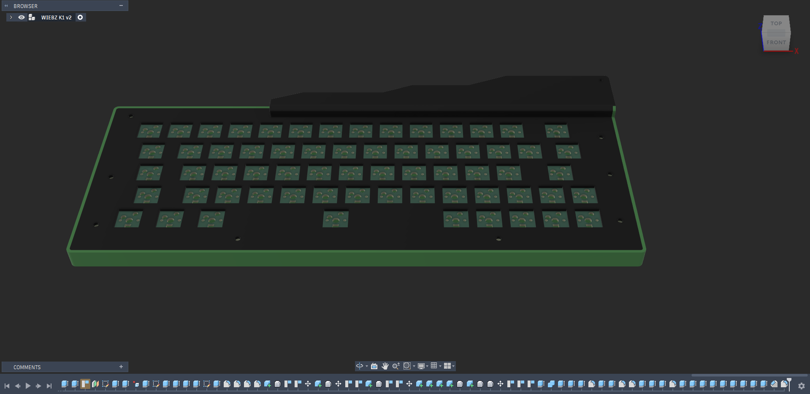

# WIEBZ-K1
The Beginning of a new brand...WIEBZ (Willed Into Existence By Zephan).....its a 60% keyboard with a cool design (i hope)
it uses a raspberry pi pico as the MCU, the switches would be hot swappable. it has a daisy chain of SK6812 mini-e leds that would be both bottom mounted for the per key led and top mounted that would serve as the ambient lights around three corners of the keyboard...and it would be running the qmk firmware. The PCB was designed in KiCad, the case in Fusion 

# Features   
- Rp2040 controller
- per-key led
- a 60% layout
- under glow lights
- qmk firmware

# BOM

| **Item**                      | **Qty**   | **Price (₦)**          | **Price($)**       | **Source**                                                                                                                                                                                                                                                                                                                                                                                                                                                                                                                                                                                                                                                                                                                                                           |
|-------------------------------|-----------|------------------------|--------------------|----------------------------------------------------------------------------------------------------------------------------------------------------------------------------------------------------------------------------------------------------------------------------------------------------------------------------------------------------------------------------------------------------------------------------------------------------------------------------------------------------------------------------------------------------------------------------------------------------------------------------------------------------------------------------------------------------------------------------------------------------------------------|
| PCB                           | 5         | 48,964.14              | 36.87 (W Shipping) | JLCPCB                                                                                                                                                                                                                                                                                                                                                                                                                                                                                                                                                                                                                                                                                                                                                               |
| Raspberry Pi Pico W           | 1         | 23,000                 | 17.32              | https://hub360.cc/shop/0408-raspberry-pi-pico-w-rp2040-type-c-dual-core-microcontroller-development-board-12216                                                                                                                                                                                                                                                                                                                                                                                                                                                                                                                                                                                                                                                      |
| Kailh Hotswappable MX Sockets | 70        | 8,237                  | 6.2                | https://www.aliexpress.com/item/1005012011087592.html?spm=a2g0o.productlist.main.19.23687332bLHZxK&algo_pvid=e4fd706c-1c1c-4431-b9ec-5773bd71d8b5&algo_exp_id=e4fd706c-1c1c-4431-b9ec-5773bd71d8b5-18&pdp_ext_f=%7B%22order%22%3A%223368%22%2C%22eval%22%3A%221%22%2C%22orig_sl_item_id%22%3A%221005012011087592%22%2C%22orig_item_id%22%3A%221005009794038277%22%2C%22fromPage%22%3A%22search%22%7D&pdp_npi=6%40dis%21NGN%2116474.42%218237.00%21%21%2173.78%2136.89%21%40214134eb17905273223806978e0c4b%2112000057272683072%21sea%21NG%217964375220%21X%211%210%21n_tag%3A-29911%3Bd%3Af57d49e4%3Bm03_new_user%3A-29895&curPageLogUid=ZSE8mI1xv3yo&utparam-url=scene%3Asearch%7Cquery_from%3A%7Cx_object_id%3A1005012011087592%7C_p_origin_prod%3A1005009794038277 |
| MX Mechanical Switches        | 70 (10*7) | 22,967.57 (W Shipping) | 17.29              | https://www.aliexpress.com/item/1005003206504286.html?spm=a2g0o.productlist.main.3.b8f41654VLycgA&algo_pvid=f2801b0d-82a7-46ab-8a0e-5c219dedf416&algo_exp_id=f2801b0d-82a7-46ab-8a0e-5c219dedf416-2&pdp_ext_f=%7B%22order%22%3A%22182%22%2C%22spu_best_type%22%3A%22price%22%2C%22eval%22%3A%221%22%2C%22fromPage%22%3A%22search%22%7D&pdp_npi=6%40dis%21NGN%213192.96%212267.00%21%21%2114.30%2110.15%21%400b08c0c217905277692458720e0f04%2112000024658535533%21sea%21NG%217964375220%21X%211%210%21n_tag%3A-29911%3Bd%3Af57d49e4%3Bm03_new_user%3A-29895&curPageLogUid=cNFM0hmjKg5j&utparam-url=scene%3Asearch%7Cquery_from%3A%7Cx_object_id%3A1005003206504286%7C_p_origin_prod%3A                                                                                |
| 1N4148 THT Diodes             | 100       | 2,207                  | 1.66               | https://www.aliexpress.com/item/4001126137167.html?spm=a2g0o.productlist.main.2.4cfb37b6KyUXtS&algo_pvid=093f6531-d1bc-4cf5-8007-ee3db067eeed&algo_exp_id=093f6531-d1bc-4cf5-8007-ee3db067eeed-1&pdp_ext_f=%7B%22order%22%3A%222116%22%2C%22spu_best_type%22%3A%22price%22%2C%22eval%22%3A%221%22%2C%22fromPage%22%3A%22search%22%7D&pdp_npi=6%40dis%21NGN%212207.00%212207.00%21%21%211.47%211.47%21%402141397017905286836131318e0ca7%2110000014629985518%21sea%21NG%217964375220%21X%211%210%21n_tag%3A-29911%3Bd%3Af57d49e4%3Bm03_new_user%3A-29895&curPageLogUid=Fgjax7A3c4sT&utparam-url=scene%3Asearch%7Cquery_from%3A%7Cx_object_id%3A4001126137167%7C_p_origin_prod%3A                                                                                       |
| Stabilizers                   | 5         | 14,321                 | 10.78              | https://www.aliexpress.com/item/4001143514438.html?spm=a2g0o.productlist.main.1.180c40f0HGmRfm&algo_pvid=68c55ac8-eff4-44c4-b19f-65739acc819b&algo_exp_id=68c55ac8-eff4-44c4-b19f-65739acc819b-0&pdp_ext_f=%7B%22order%22%3A%22129%22%2C%22eval%22%3A%221%22%2C%22fromPage%22%3A%22search%22%7D&pdp_npi=6%40dis%21NGN%2113616.00%2113616.00%21%21%219.07%219.07%21%402141137e17905299800648528e0ea6%2112000033301894112%21sea%21NG%217964375220%21X%211%210%21n_tag%3A-29911%3Bd%3Af57d49e4%3Bm03_new_user%3A-29895&curPageLogUid=hGLGjyTulFV4&utparam-url=scene%3Asearch%7Cquery_from%3A%7Cx_object_id%3A4001143514438%7C_p_origin_prod%3A                                                                                                                          |
| SK6812 MINI-E leds            | 100       | 5,224                  | 3.93               | https://www.aliexpress.com/item/1005007863635868.html?spm=a2g0o.productlist.main.6.14c8547fFrwORl&algo_pvid=d5345fc8-f421-434d-a9b3-912494c1ab0e&algo_exp_id=d5345fc8-f421-434d-a9b3-912494c1ab0e-5&pdp_ext_f=%7B%22order%22%3A%22644%22%2C%22eval%22%3A%221%22%2C%22fromPage%22%3A%22search%22%7D&pdp_npi=6%40dis%21NGN%215224.00%215224.00%21%21%213.48%213.48%21%4021410daa17905379482431718e0f31%2112000042594617264%21sea%21NG%217964375220%21X%211%210%21n_tag%3A-29911%3Bd%3Af57d49e4%3Bm03_new_user%3A-29895&curPageLogUid=zBx0bm7r2RNj&utparam-url=scene%3Asearch%7Cquery_from%3A%7Cx_object_id%3A1005007863635868%7C_p_origin_prod%3A                                                                                                                      |
| Transparent PETG              | 250g      | 25,099                 | 18.9               | https://www.aliexpress.com/item/1005012249653635.html?algo_pvid=98b1bec3-6d77-4bc0-b4a1-5c828b0e7215&algo_exp_id=98b1bec3-6d77-4bc0-b4a1-5c828b0e7215-1&pdp_ext_f=%7B%22order%22%3A%2285%22%2C%22eval%22%3A%221%22%2C%22fromPage%22%3A%22search%22%7D&pdp_npi=6%40dis%21NGN%2151518.37%2125244.00%21%21%21230.72%21113.05%21%40212e37eb17905384594267198e101f%2112000057867753095%21sea%21NG%217964375220%21X%211%210%21n_tag%3A-29911%3Bd%3Af57d49e4%3Bm03_new_user%3A-29895&curPageLogUid=4ECKxfp5A1b7&utparam-url=scene%3Asearch%7Cquery_from%3A%7Cx_object_id%3A1005012249653635%7C_p_origin_prod%3A                                                                                                                                                             |
| Matte Black Petg              | 1kg       | 65,586                 | 49.39              | https://www.aliexpress.com/item/1005010748782693.html?spm=a2g0o.productlist.main.2.3d74a807Xd0x6n&algo_pvid=dff2161a-ec42-4b8d-bb71-3244e73a75a9&algo_exp_id=dff2161a-ec42-4b8d-bb71-3244e73a75a9-1&pdp_ext_f=%7B%22order%22%3A%2231%22%2C%22eval%22%3A%221%22%2C%22fromPage%22%3A%22search%22%7D&pdp_npi=6%40dis%21NGN%2165586.00%2165586.00%21%21%2143.69%2143.69%21%402102ef5e17905387002104938e0f21%2112000053385455121%21sea%21NG%217964375220%21X%211%210%21n_tag%3A-29911%3Bd%3Af57d49e4%3Bm03_new_user%3A-29895&curPageLogUid=UkhFswVuA9qj&utparam-url=scene%3Asearch%7Cquery_from%3A%7Cx_object_id%3A1005010748782693%7C_p_origin_prod%3A                                                                                                                   |
| Screws                        | 0         | 0                      | 0                  | Self-Covered                                                                                                                                                                                                                                                                                                                                                                                                                                                                                                                                                                                                                                                                                                                                                         |
| Heat Inserts                  | 0         | 0                      | 0                  | Self-Covered                                                                                                                                                                                                                                                                                                                                                                                                                                                                                                                                                                                                                                                                                                                                                         |
| Key Caps                      | 133 keys  | 19,885                 | 14.97              | https://www.aliexpress.com/item/1005009592262575.html?spm=a2g0o.productlist.main.2.711f3e457cKNiY&algo_pvid=7fbda4a7-b7a8-44b1-97d1-95525804c150&algo_exp_id=7fbda4a7-b7a8-44b1-97d1-95525804c150-1&pdp_ext_f=%7B%22order%22%3A%22369%22%2C%22spu_best_type%22%3A%22price%22%2C%22eval%22%3A%221%22%2C%22fromPage%22%3A%22search%22%7D&pdp_npi=6%40dis%21NGN%2141427.08%2119885.00%21%21%21185.52%2189.05%21%400be71e1917905404057533196e0c73%2112000049561056701%21sea%21NG%217964375220%21X%211%210%21n_tag%3A-29911%3Bd%3Af57d49e4%3Bm03_new_user%3A-29895&curPageLogUid=Qs7ffMCvOio6&utparam-url=scene%3Asearch%7Cquery_from%3A%7Cx_object_id%3A1005009592262575%7C_p_origin_prod%3A                                                                             |
| TOTAL                         |           | 212,523.14             | 140.44             |                                                                                                                                                                                                                                                                                                                                                                                                                                                                                                                                                                                               

# Images
## Schematics
#### Keyboard Matrix

#### LED Chain

#### MCU

## PCB
#### PCB Design

#### PCB 3D Render

## Case

#### Full Case

